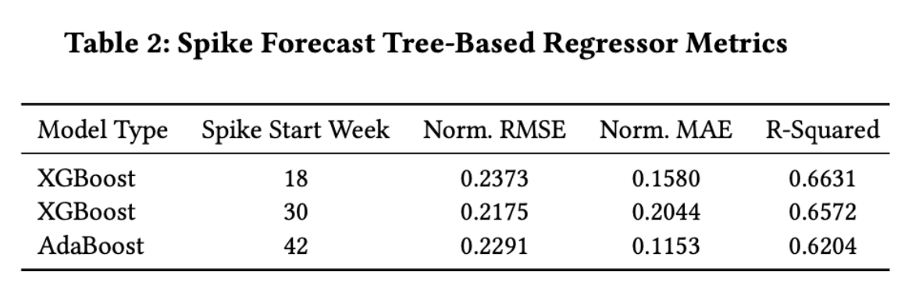
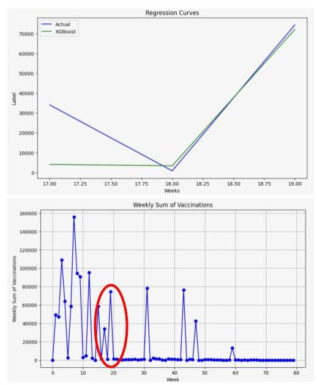
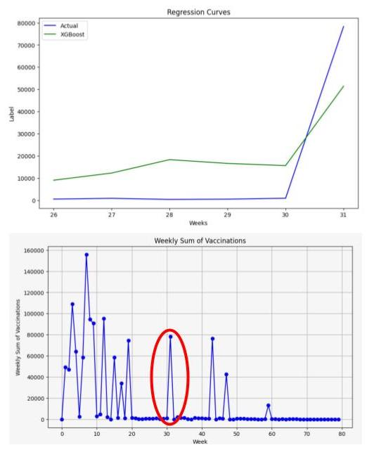
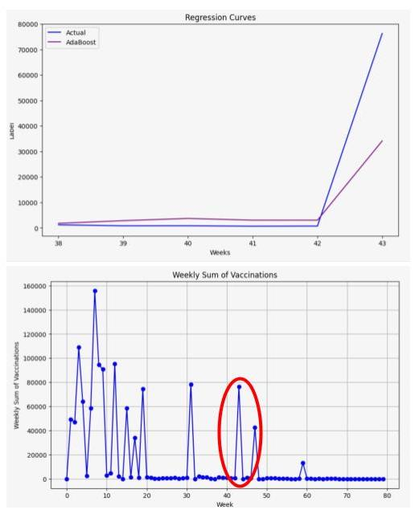
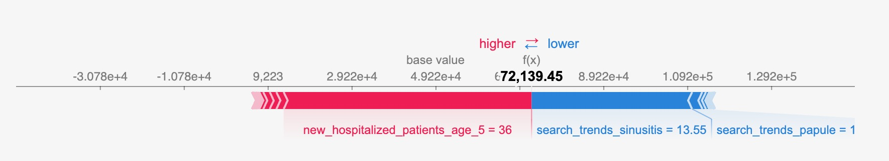
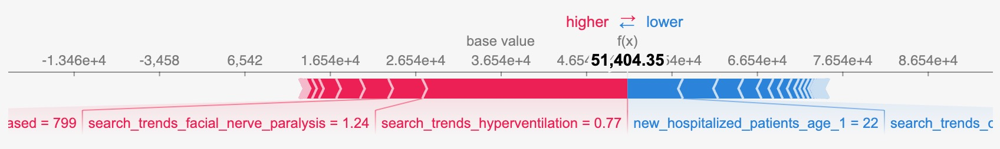
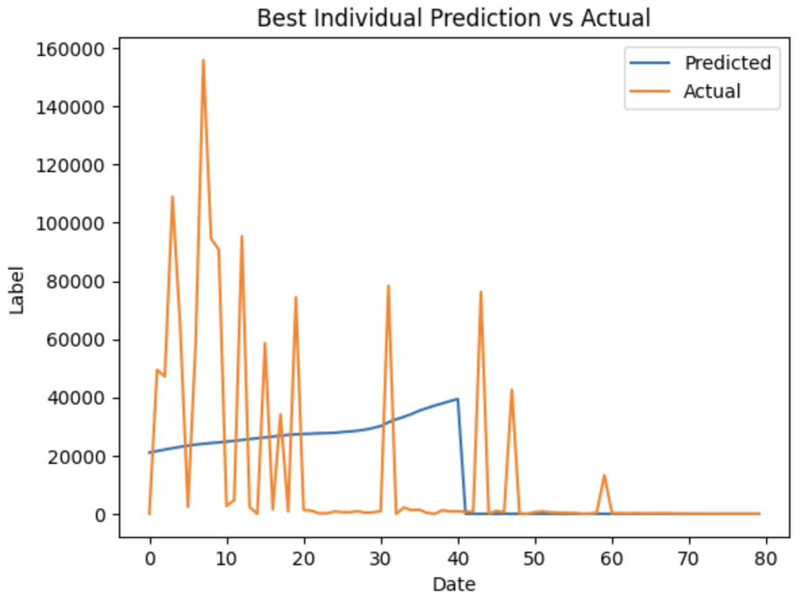

# Estimating Vaccination Uptake for COVID-19 with a Focus on Interpretability
By Amish Saini and Kartik Narang

    
    

## Summary of Project
The COVID-19 pandemic has had a devastating impact worldwide, causing regional disparities in COVID-19 prevalence to emerge. These disparities demonstrate a need for predictive modeling strategies to make the best decisions that reduce the burden on our healthcare system. There were many periods where the vaccination rates in the US were stagnant, despite widespread availability at many points. Understanding the most important factors that impact vaccination uptake using Genetic Programming (GP) and interpretable Tree-Based models can be fruitful to increase vaccination coverage.

Formally, we apply GP and Tree-Based models to forecast COVID-19 vaccination uptake and identify the most important factors that cause stagnant periods of vaccination rates. The goal with this is that public health officials can develop targeted interventions for groupings of populations to promote vaccine uptake.

## Results
### Tree-Based Regressors
We were able to successfully and accurately predict vaccination uptake spikes as shown in the images below.

    
    
    

#### Interpretability
Utilizing SHAP, we were able to interpret the model's decisions and understand the features that led to the spikes.

## GP
After Running 500 Generations of a population size of 1000, we were not able to reach accurate results as shown in the image below. Due to the computational complexity of genetic programming and the limit computation resources available to us, our results were bottlenecked by runtime.

# Code Explained

There are 2 ways to run the code:

## Kaggle

[Link](https://www.kaggle.com/code/amish30/vaccination-prediction)

Click on Copy & Edit to make your version and Run All.

The current state of the code will then go through Dataset Creation, EDA, Feature Selection, Modeling, and Interpretation

## Locally using ipynb file

To run our Juypter Notebook you will first need to satisfy package requirements:

pip install -r requirements.txt

After satisfying the requirements, to demo the code, just Run All.

The current state of the code will then go through Dataset Creation, EDA, Feature Selection, Modeling, and Interpretation

